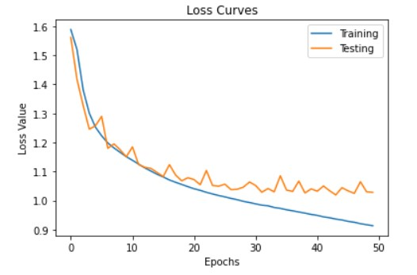
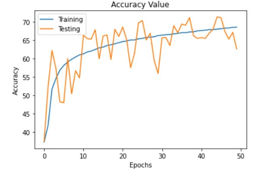

# Review Classification

Review Classification is the special case of Natural Language Processing techniques known as Sentiment Analysis. The objective is identify how good or bad the reviews posted by customers are. I am going to use the `Amazon Fine Food Reviews` dataset from Kaggle which can be found by following the link in references.

## About Dataset
This dataset consists of reviews of fine foods from amazon. The data span a period of more than 10 years, including all ~500,000 reviews up to October 2012. Reviews include product and user information, ratings, and a plain text review. It also includes reviews from all other Amazon categories.

Data includes:
- Reviews from Oct 1999 - Oct 2012
- 568,454 reviews
- 256,059 users
- 74,258 products
- 260 users with > 50 reviews

## Notebooks
- `Text Cleaning` : the notebook shows basic exploratory analysis and text cleaning.
- `Batching and Model Training` : The notebook contains code for Batching using `Bucket-Iteratinng` technique and a `BaseModel`.
- `Bidirectional LSTM with torchtext.ipynb` : The notebook uses `torchtext` and `spacy` for text preprocessing followed by training a Bi-LSTM model.

## Model graphs
- Base model Results    
  

- BiDirectional LSTM with SGD Results    
  

## Results
- Base model : Got a Validation accuracy of *68.18*
- Bi-LSTM : Got a Validation accuracy of *71.31*

## References
- Dataset : https://www.kaggle.com/snap/amazon-fine-food-reviews
- Sentiment Analysis : https://towardsdatascience.com/detecting-bad-customer-reviews-with-nlp-d8b36134dc7e
- Evaluation Metrics : https://medium.com/@MohammedS/performance-metrics-for-classification-problems-in-machine-learning-part-i-b085d432082b